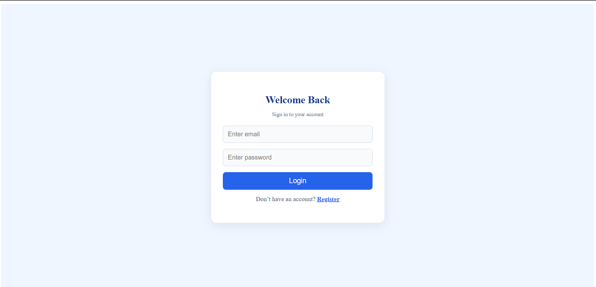
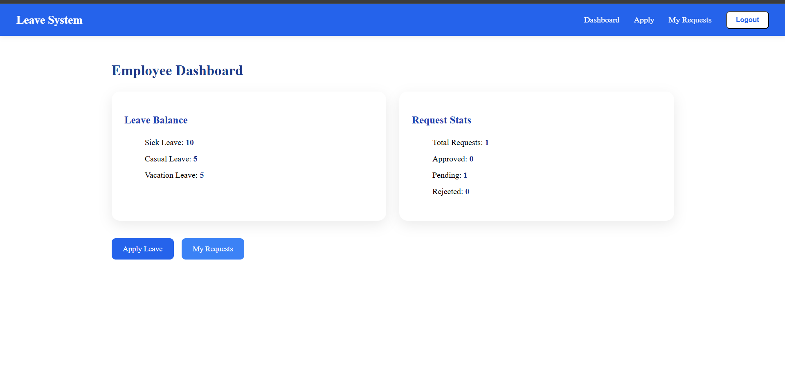
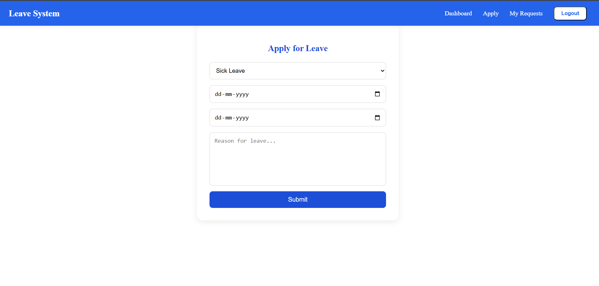
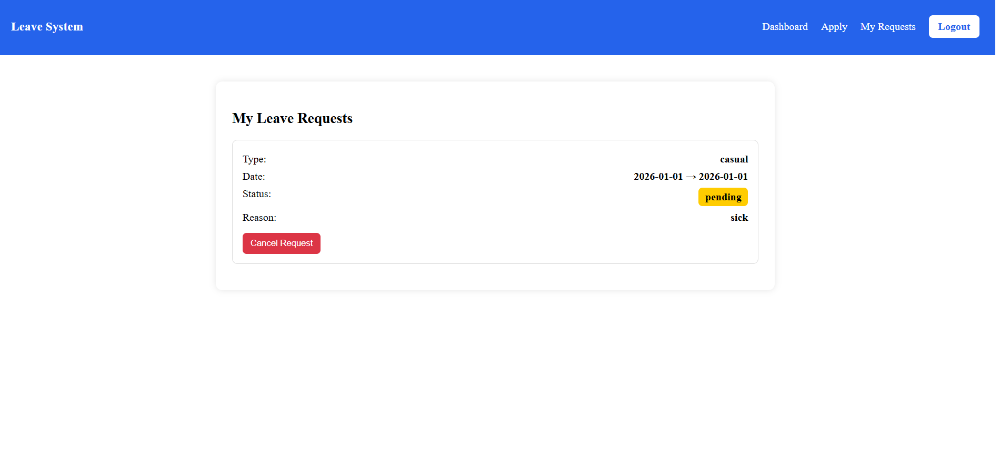

# Employee Leave Management System  
A MERN-based Employee Leave Management web application where employees can apply for leave and managers can approve or reject requests.  
Modern UI with authentication, dashboards, and real-time leave updates.

---

##  Live Demo  
### 🔹 Frontend (Vercel)  
➡️ https://your-frontend-url.vercel.app

### 🔹 Backend (Render)  
➡️ https://your-backend-url.onrender.com

---

##  Features  
###  Employee  
- Apply for leave  
- View leave history  
- Track leave status (Pending / Approved / Rejected)  
- Dashboard with leave summary  

###  Manager  
- View pending leave requests  
- Approve / Reject requests  
- View all employee leave records  
- Dashboard with quick stats  

---

## 🛠️ Tech Stack  
- **Frontend:** React (Vite), Redux Toolkit, Axios  
- **Backend:** Node.js, Express, MongoDB, JWT Authentication  
- **Hosting:** Vercel (Frontend), Render (Backend)

---

# 🔧 Setup & Run Locally

## 1. Clone the Repository  
```sh
git clone https://github.com/your-username/Employee-Management-System.git

```
## 2. Backend Setup

```sh
cd backend
npm install
```

-- Create a .env file

```sh
PORT=5000
MONGO_URI=your-mongodb-url
JWT_SECRET=your-secret
```

-- Run backend
```sh
npm run dev
```

## 3. Frontend Setup
```sh
cd frontend
npm install
```

-- Create a .env file
```sh
VITE_API_URL=https://your-backend-url.onrender.com/api
```

-- Run frontend:
```sh
npm run dev
```

##  Screenshots

###  Login Page  


###  Employee Dashboard  


###  Apply Leave Page  


###  My Requests 


###  Manager Dashboard  

